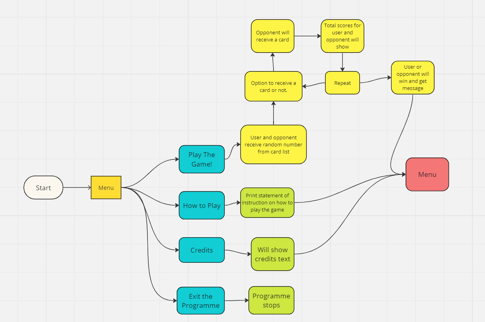

# Blackjack

## User

### First Time User

- For a first time user the menu should be straight forward and easy to navigate as you do not want one which is confusing which could deter them from using it further.

### Returning User

- A returning user should find the first time on the game to be easy to maneuover efficient enough to want to return to the game.

### Frequent User

- A frequent user should feel the game is reliable and worth spending time on.

- It should have different ways to end the game in order for it be replayable.

## Purpose

The purpose of was to create a fully functioning game of twenty one which is very popular across the globe.

It should be easy to play with clear input which only accepts "Hit" and "Stick".

## How to play

- When programn is started a menu will appear which will present 4 different options.

- The 4 different options are start the game, how to play, credits and exit programn.

- If the user inputs 1 then the game will start.

- If user inputs 2 they will be shown how to play the game.

- If the input is 3 they will be shown the credits of the project.

- If the user inputs 0 the programn will stop.

- When the input to start the game is entered there will be 2 cards given, one to the user and one to the opponent.

- Afterwards there will be a input option of hit and stick, this will allow the user to make a choice on whether to get another card or to not recieve anymore.

- If the user sticks then the opponent will get an extra card.

- If either user or opponent goes over 21 they will lose.

## Technology Used

- Python was used to make the code.
- VS code was used to write the code.
- Git Hub was where the repository and code is stored.
- Pep8Ci was used to make sure that the code is correct
- Heroku is used for deployment

## Bugs

### Solved Bugs

### Unsolved Bugs

### Mistakes

- In the git commit e13f5e6 I have spelt the work frequent incorrectly.

- Another mistake I made was that I spelt receiving wrong in git commit 121de2b. 
## Deployment

- I have deployed my work to heroku