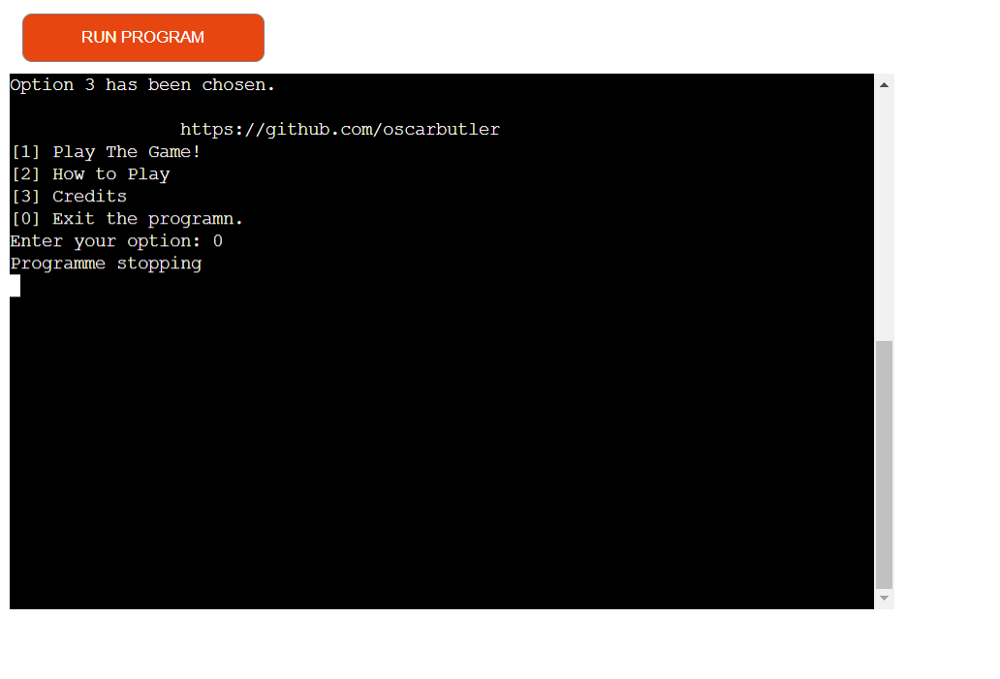

# Blackjack

## User

### First Time User

- For a first time user the menu should be straight forward and easy to
 navigate as you do not want one which is confusing which could deter them
from using it further.

- It should be easy to play as it has essentially step by step instructions on
 how to play as you progress through the game.

 - It should be clear on what the user has to input in order to progress
 through the menu and game.

### Returning User

- A returning user should find the first time on the game to be easy to
 maneuover efficient enough to want to return to the game.

- The game should be functional in order for the user to come back and use
the programn.

- The user should not be able to win every time so that it can pose a
challenge and be engaging towards the user.

### Frequent User

- A frequent user should feel the game is reliable and worth spending time on.

- It should have different ways to end the game in order for it be replayable.

## Purpose

The purpose of was to create a fully functioning game of twenty one which
 is very popular across the globe.

It should be easy to play with clear input which only accepts
 "Hit" and "Stick".

## How to play

- When programn is started a menu will appear which will present 4 
 different options.

- The 4 different options are start the game, how to play, credits and
 exit programn.

- If the user inputs 1 then the game will start.

- If user inputs 2 they will be shown how to play the game.

- If the input is 3 they will be shown the credits of the project.

- If the user inputs 0 the programn will stop.

- When the input to start the game is entered there will be 2 cards given,
 one to the user and one to the opponent.

- Afterwards there will be a input option of hit and stick, this will allow
 the user to make a choice on whether to get another card or to
  not recieve anymore.

- If the user sticks then the opponent will get an extra card.

- If either user or opponent goes over 21 they will lose.

## Features

When you first run the programme you will see this menu.

This is one of the options you can pick from the menu.

## Technology Used

- Python was used to make the code.
- VS code was used to write the code.
- Git Hub was where the repository and code is stored.
- Pep8Ci was used to make sure that the code is correct
- Heroku is used for deployment
- Mero was used in order to create a workflow image

## Packages

- I have used the random package in order to receive a different number every
time.

- I have used imported os so that I can clear the terminal and make it look
presentable.

## Testing

- You can find everything about testing in the [TESTING.md](TESTING.md)

## Credits

- I got help with the menu from this 
[Video](https://www.youtube.com/watch?v=63nw00JqHo0)

- I learnt the python lagnuage through Code Institutes courses that were
provided.

- I have been able to use VScode for free which is where I am able type the
code for this programme.

- I have been able to use heroku for free of charge through the code institute
course.

## Bugs

### Solved Bugs

- When I entered a letter into the menu input it would break the programme
 and it would have to be restarted.
In order to solve that I added this code.

- There was a bug that made the user input a number twice when choosing an
option in the menu. To fix this I moved the loop out of the main function
and into the print menu function.

### Unsolved Bugs

- A bug that appeared was in the deployed version the text "Running startup
command: python3 run.py" appears. This does not come up when testing in vsCode
which makes it very difficult to get rid off.

### Mistakes

- In the git commit e13f5e6 I have spelt the work frequent incorrectly.

- Another mistake I made was that I spelt receiving wrong in git
 commit 121de2b.

- Mistakenly add a commit meant for README.md but added it to run.py

## Deployment

- I have deployed my work to heroku

 Create a application
 

 Go to the deploy section

 

 Link your github account

 

 Connect to the github repository

 

Go to the settings section

Add the buildpacks in the correct order

Click "Reveal Config Vars" and enter:
Key: PORT Value: 8000

In the deploy section press "Deploy Branch"

Once branch is deployed you press "View" and you will see your programn.

