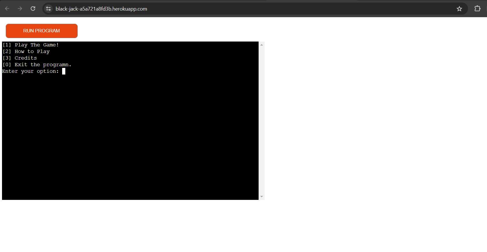
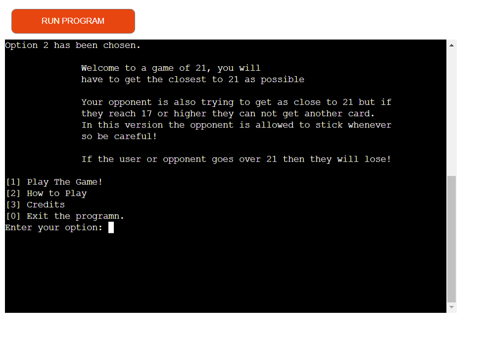
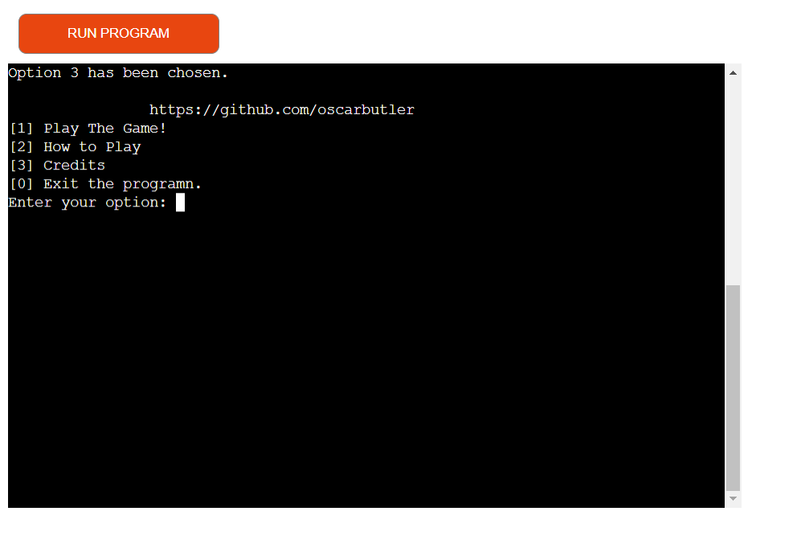

# Testing

## Manual Testing

| feature | action | expected result | tested | passed | comments |
| --- | --- | --- | --- | --- | --- |
| Run programme | Start the programme | The user should see a menu with
 different options | Yes | Yes | - |
| Enter '1' into the input given | Enter '1' | The user should be taken to the
 game | Yes | Yes | --- |
| Enter '2' into the input given | Enter '2' | The user should be taken to how
 to play section | Yes | Yes | --- |
| Enter '3' into the input given | Enter '3' | The user should be taken to the
 credits section | Yes | Yes | --- |
| Enter '0' into the input given | Enter '0' | The programn should stop
 | Yes | Yes | --- |
| Invalid input | Enter a number not in the menu | Get a error saying that the
 number is invalid | Yes | Yes | --- |
| In game should get hit or stick
 available input | --- | --- | --- | --- | --- |
| Hit | input hit | User and opponent should recieve a card | Yes | Yes | --- |
| User goes over 21 | User gets another card that puts it over 21 | No hit or 
stick input option,
message saying user lost and menu will appear | Yes | Yes | --- |
| Opponent is between 17 and 21 | If opponents total score is between 17 and 21
 it should stick | It does not recieve another card | Yes | Yes | --- |
| Stick | User inputs stick | User should not recieve a card | Yes | Yes | --- |
| Opponent goes over 21 | Opponent gets a card which makes it go over 21 |
 It should say that the user wins and menu will appear | Yes | Yes | --- |
| --- | --- | --- | --- | --- | --- |

