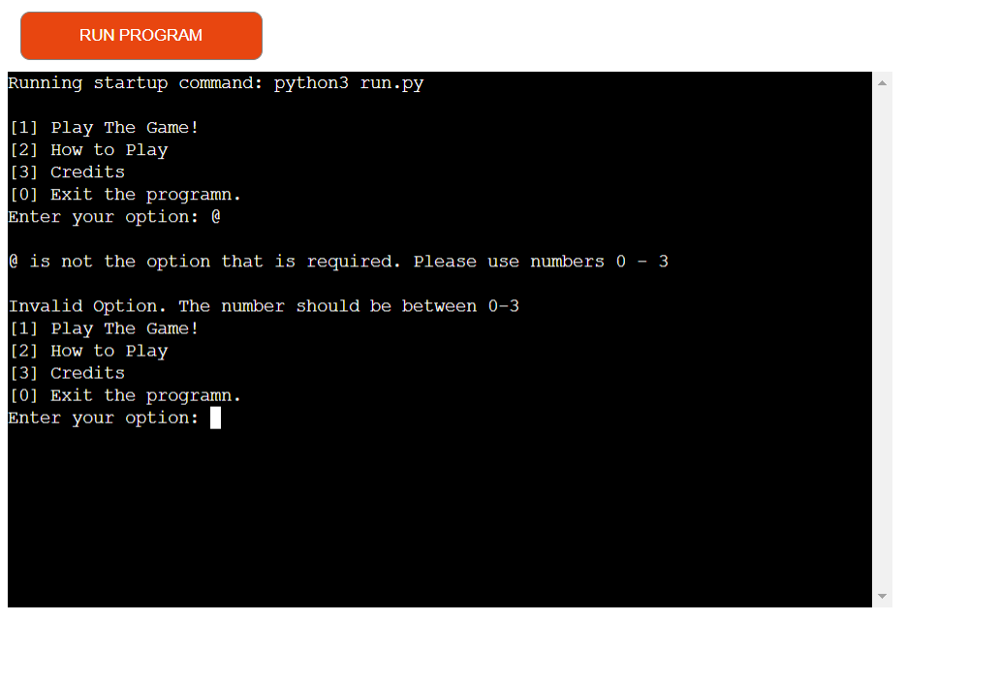

# Testing

## Manual Testing

| feature | action | expected result | tested | passed | comments |
| --- | --- | --- | --- | --- | --- |
| Run programme | Start programme | See a menu with options | Yes | Yes | - |
| Enter '1' into input | Enter '1' |  Go to the game | Yes | Yes | --- |
| Enter '2' into input | Enter '2'| Go to how to play section | Yes | Yes | - |
| Enter '3' into input | Enter '3' | Go to credits section | Yes | Yes | - |
| Enter '0' into input | Enter '0' | The programn should stop | Yes | Yes | - |
| Invalid input | Enter an invalid number| Error saying that the number is invalid | Yes | Yes | - |
| Hit or stick input | Hit or stick input | See a input for hit and stick | Yes | Yes | -- |
| Hit | input hit | User and opponent should recieve a card | Yes | Yes | --- |
| User goes over 21 | Users total score goes above 21 | Message saying user lost and menu appears | Yes | Yes | --- |
| Opponents between 17 and 21 | Opponents score is between 17 and 21 it sticks | Does not recieve another card | Yes | Yes | - |
| Stick | User inputs stick | User should not recieve a card | Yes | Yes | --- |
| Opponent goes over 21 | Opponent gets a card which makes it go over 21 | User wins and menu will appear | Yes | Yes | --- |
| --- | --- | --- | --- | --- | --- |

## The Game

This is the programme being run, but it shows how inputting 'hit' will effect
the programme.

These are images of the game being played but the user inputting stick

## Pep8

## Testing

### Menu

In the menu I have taken these screenshots to present that there are errors if
the user does not enter the correct inputs.

### The Game

These screenshots show a different types of incorrect inputs which clearly show
errors and that they need to try again.

